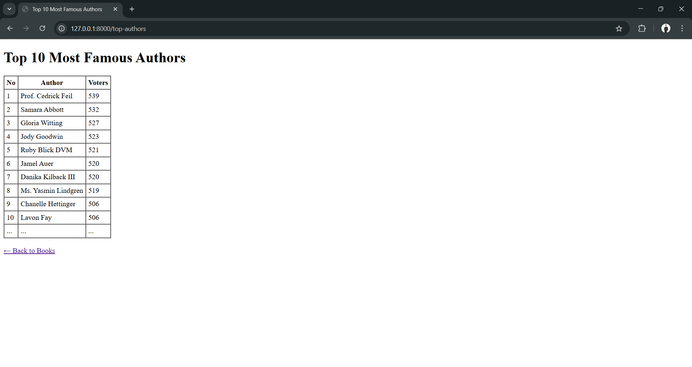

# Laravel Bookstore Exam Project

This project was developed as part of the recruitment test for the **Backend Programmer** position.
The application manages books, authors, ratings, and displays Top Authors ranking.
All data is fully generated from **migrations** and **seeders** according to the requirements — no MySQL dump is used.

---

## Requirements
- PHP 8.2
- Laravel 12
- Composer
- MySQL

---

## Installation Steps

1. **Clone the repository**
   ```bash
   git clone https://github.com/okadwaja/bookstore_exam.git
   cd bookstore_exam

2. **Install dependencies**
   ```bash
   composer install

3. **Copy `.env` file**
   ```bash
   cp .env.example .env

4. **Set up database configuration in `.env`**
   ```bash
    DB_CONNECTION=mysql
    DB_HOST=127.0.0.1
    DB_PORT=3306
    DB_DATABASE=bookstore_exam
    DB_USERNAME=root
    DB_PASSWORD=

5. **Generate application key**
   ```bash
   php artisan key:generate

6. **Run migration and seeder**
   This will automatically generate 100,000 books and 500,000 ratings.
   ```bash
   php artisan migrate:fresh --seed

7. **Run the development server**
   TAccess the application at http://127.0.0.1:8000
   ```bash
   php artisan serve

## Features
- **List Books**
  Displays a list of books with:
  - Numbering
  - Book title
  - Author name
  - Average rating
  - Total voters
  - Search filter and pagination

- **Top Authors**
  Displays the top 10 authors based on the average rating of their books.

- **Insert Rating**
  Rating input form with:
  - Author → Book dropdown
  - Rating validation (1–10)
  - Direct save to `ratings` table

## 🖼️ Screenshots

### 📚 List Books


### 🏆 Top Authors


### ✏️ Insert Rating


